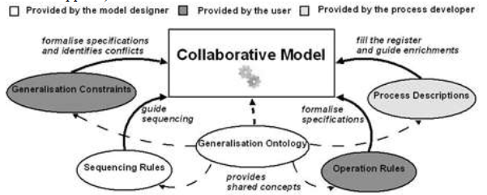
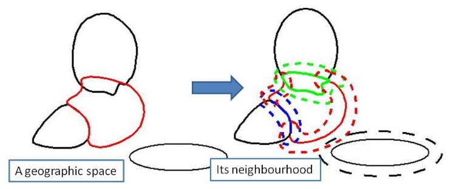
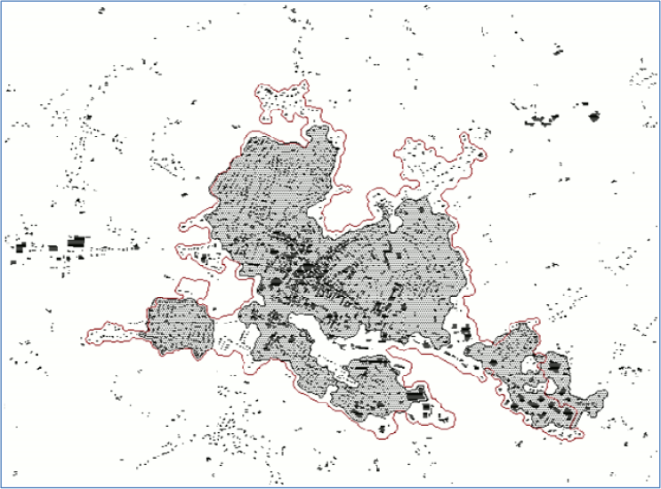
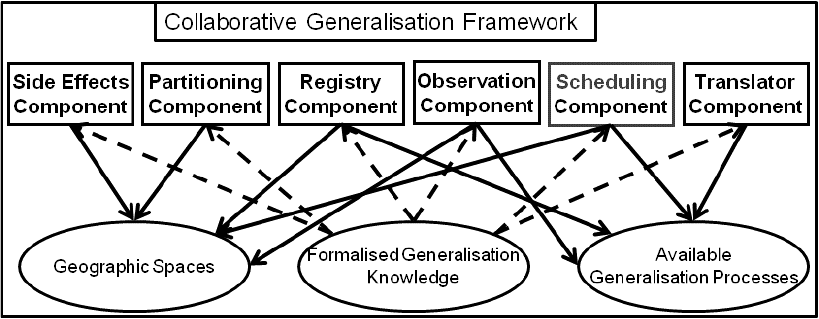

# Tutorial to the advanced use of the CollaGen orchestration framework
This tutorial explains how to use the CollaGen orchestration framework. While generalization processes such as [AGENT][3], or [CartACom][4], orchestrate the use of generalization algorithms, CollaGen goes one step upper in the generalization orchestration by orchestrating the use of generalization processes on different parts of the map, in order to fully generalize a complete map. The CollaGen framework is described in the following papers [8], [9], [10], [11], [7].
Be aware that this implementation is for now mainly based on research code that has not been consolidated. Many bugs still remain and some functionalities described in the papers describing the model are not implemented in CartAGen.

> - Date 23/07/2018.
> - Author: [Guillaume Touya][1]
> - Contact {firstname.lastname}@ign.fr.

Generalization ontology
-------------

To be done...

Formalized constraints and rules
-------------

To be done...

Geographic spaces
-------------

To be done...

Different types of geographic spaces are implemented in CartAGen:
- metric spaces
  - [urban space][18]
  - [rural space][16]
  - [rurban space][17]
  - [mountain space][13]
  - [coastal space][12]
- thematic spaces
  - [road network space][15]
  - [vegetation space][19]
  - [river area space][14]

For some of the geographic spaces, different methods are available to delimit the space, as the definition of an urban space is quite fuzzy. The image below shows two different limits for an urban space obtained by the algorithms from Chaudhry & Mackaness (2008), and from Boffet (2000).

Constraint monitors and evaluation
-------------

To be done...

There are global evaluation methods from a set of constraint monitors implemented in CartAGen, based on the social welfare economical theories (see [this paper][7] for more details).

Generalization processes
-------------

Generalization processes in the CollaGen sense encapsulate some code from CartAGen in a standardized way, just like the [AGENT actions encapsulate algorithms][3]. You can find the code of the implemented CollaGen processes [here][20]. Here is a list of the available processes:
- *CartACom Process*: pretty simple CartACom process that only generalizes buildings.
- *Crossroad Collapse Process*: collapses small roundabouts and branching crossroads into simple point crossroads.
- *Forest Generalization Process*: remove small features and small holes, then simplifies and aggregates the forests with morphological closing and opening operations.
- *Push Networks*: pushes network features (roads, rivers, railways) from each other when they overlap with a least squares adjustment.
- *River Areas Generalization*: aggregates and simplifies river areas, and remove the small holes/islands.
- *Rural AGENT Process*: an AGENT process with constraints and actions dedicated to rural buildings.
- *Rural Road Selection*: a process that selects the important roads in rural/rurban areas, derived from (Touya, 2010, Transactions in GIS).
- *Urban AGENT Process*: a classical AGENT process with standard constraints/actions on towns, blocks and building features.
- *Urban Least Squares*: a least squares adjustment that displaces and distorts buildings and roads in urban/rurban areas.

To be used in the registry and scheduling components, a formal description of these processes is required, but this part of the framework is not implemented yet. However, the processes can still be used to generalize a geographic space, see the following section.

Trigger generalization processes on a geographic space
-------------

To be done...

What is missing for now
-------------
CollaGen is composed of six compenents and three types of resources (see the image below), and the implementation of the framework in CartAGen is far from complete, even if this tutorial shows that the implemented components and resources can be used as standalone.

Components that are partially implemented:
- Registry component
- Scheduling component
- Translator component

Components that are not implemented at all:
- Observation component
- Side effects component

The priority to complete this implementation is not high, but if you are interested in the use of missing components, please contact us.

See Also
-------------
- [Advanced use of CartACom][4]
- [Advanced use of AGENT][3]
- [Advanced use of GAEL][5]
- [Advanced use of DIOGEN][6]

[1]: http://recherche.ign.fr/labos/cogit/english/cv.php?prenom=&nom=Touya
[2]: /tuto_agents.md
[3]: /agents/AGENT_advanced.md
[4]: /agents/CartACom_advanced.md
[5]: /agents/GAEL_advanced.md
[6]: /agents/DIOGEN_advanced.md
[7]: http://dx.doi.org/10.1007/978-3-642-33024-7_15
[8]: http://dx.doi.org/10.1007/978-3-642-19143-5_30
[9]: http://dx.doi.org/10.1007/978-3-642-15300-6_19
[10]: https://www.researchgate.net/publication/221225218_Emergence_de_zones_conflits_dans_deux_modeles_de_generalisation_cartographique_multi-agents
[11]: https://www.researchgate.net/publication/228731016_Relevant_Space_Partitioning_for_Collaborative_Generalisation
[12]: https://github.com/IGNF/CartAGen/blob/master/cartagen-core/src/main/java/fr/ign/cogit/cartagen/collagen/geospaces/spaces/CoastalSpace.java
[13]: https://github.com/IGNF/CartAGen/blob/master/cartagen-core/src/main/java/fr/ign/cogit/cartagen/collagen/geospaces/spaces/MountainSpace.java
[14]: https://github.com/IGNF/CartAGen/blob/master/cartagen-core/src/main/java/fr/ign/cogit/cartagen/collagen/geospaces/spaces/RiverAreasSpace.java
[15]: https://github.com/IGNF/CartAGen/blob/master/cartagen-core/src/main/java/fr/ign/cogit/cartagen/collagen/geospaces/spaces/RoadNetworkSpace.java
[16]: https://github.com/IGNF/CartAGen/blob/master/cartagen-core/src/main/java/fr/ign/cogit/cartagen/collagen/geospaces/spaces/RuralSpace.java
[17]: https://github.com/IGNF/CartAGen/blob/master/cartagen-core/src/main/java/fr/ign/cogit/cartagen/collagen/geospaces/spaces/RurbanSpace.java
[18]: https://github.com/IGNF/CartAGen/blob/master/cartagen-core/src/main/java/fr/ign/cogit/cartagen/collagen/geospaces/spaces/UrbanSpace.java
[19]: https://github.com/IGNF/CartAGen/blob/master/cartagen-core/src/main/java/fr/ign/cogit/cartagen/collagen/geospaces/spaces/VegetationSpace.java
[20]: https://github.com/IGNF/CartAGen/tree/master/cartagen-core/src/main/java/fr/ign/cogit/cartagen/collagen/processes/implementation
