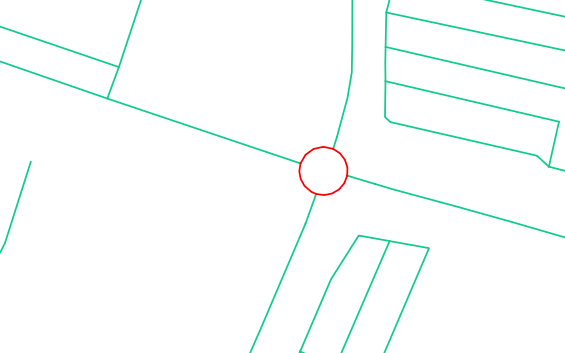
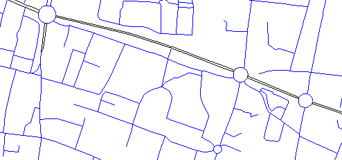
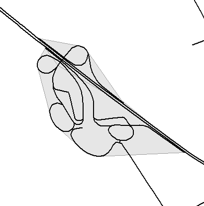
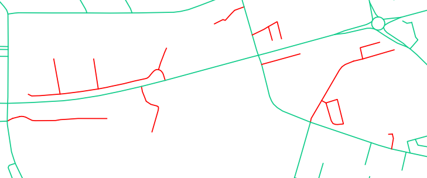

# Description of the road network enrichment algorithms

> - Date 20/07/2017.
> - Author: [Guillaume Touya][1]
> - Contact {firstname.lastname}@ign.fr.

Roundabouts and branching crossroads
-------------
To be filled...

Simple crossroads classification
-------------
To be filled...

Dual carriageways
-------------
To be filled...

Rest areas
-------------
Rest areas are highway side-roads where drivers can park and rest, and that are often only connected to highways in the network.
The properties of the structure are the presence of an entrance and an exit, with roads in between located on both sides of dual carriageways or other major highways. The detection algorithm is composed of two main steps:
1. the detection and grouping of entrances and exits, and the addition of in-between roads. Entrances and exits are detected with y-nodes and their orientation (see Figure below). The y-nodes belonging to an interchange are excluded and couples (entrance, exit) are formed considering the highway direction.
2. Then, we switch once again to faces and a buffer is used on the good side (considering the direction) of the major road in which the small neighbouring faces are aggregated (see both examples of automatic detection below).

According to our experiments, a buffer size of 500 m and an area threshold for the faces to be included in the rest area of 50,000 m2 are effective thresholds.

The implementation in CartAGen is not finished yet.

Highway interchange
-------------
To be filled...

Dead end roads
-------------
Dead end roads are another road structure that play a key role in selection processes because they are either useless (leading to nowhere important) or very important (leading to a significant facility). Unlike simple dead ends, the detection of dead end groups is not obvious. It uses the notion of minimal graph cycles: the roads that do not belong to a minimal cycle or that belong to a cycle disconnected from the graph (case with a roundabout at the end of the dead end) are considered as dead ends and are then grouped by connectivity. In the test data, optional facility data is available so dead ends are enriched with access to the facility when access exists (when the nearest access to the network of a facility point is a dead end).

The code to detect dead end roads is [here][6]

See also
-------------
- [Building measures][2]
- [Geographic spaces][3]
- [Other measures][4]
- [Road network selection algorithms][5]

[1]: http://recherche.ign.fr/labos/cogit/english/cv.php?prenom=&nom=Touya
[2]: /spatial_analysis/building_measures.md
[3]: /spatial_analysis/geographic_spaces.md
[4]: /spatial_analysis/other_measures.md
[5]: /algorithms/networks/road_selection.md
[6]: https://github.com/IGNF/CartAGen/blob/master/cartagen-core/src/main/java/fr/ign/cogit/cartagen/spatialanalysis/network/DeadEndGroup.java
