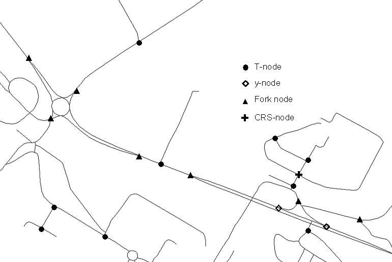
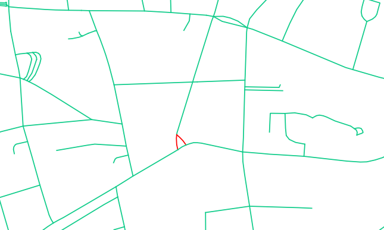
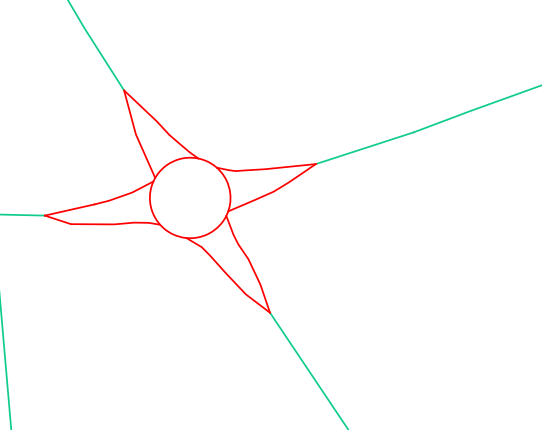
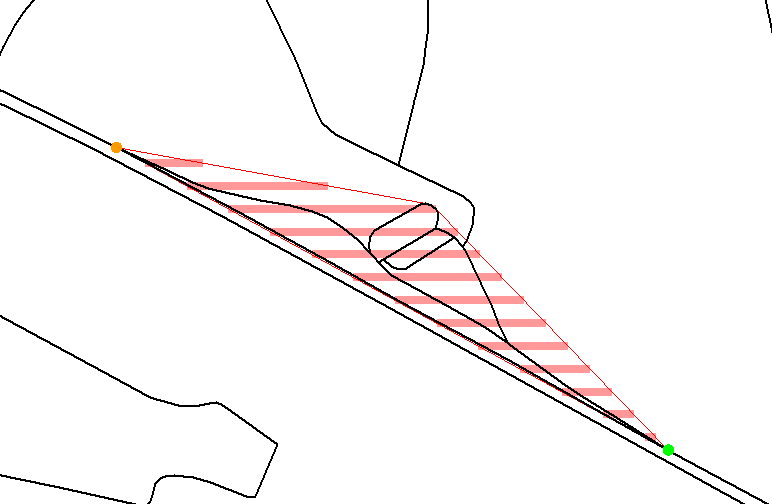
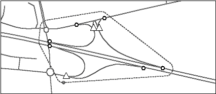

# Description of the road network enrichment algorithms

> - Date 20/07/2017.
> - Author: [Guillaume Touya][1]
> - Contact {firstname.lastname}@ign.fr.

Simple crossroads classification
-------------
Road crossroads can be considered as an atomic element of road network and it is very useful to characterize them for selection according to [Heinzle et al. (2005)][7]. For example, y-nodes correspond to slip roads and T-nodes represent crossroads between a minor and a major road. A simple taxonomy of crossroads has been designed based on Grosso (2004) and Sester (1995). It contains T-shaped nodes (T-nodes), fork nodes, y-shaped nodes (slip road end), plus-shaped nodes (CRS-nodes), star nodes and standard nodes.
The spatial analysis algorithms developed rely on a mixed use of geometry and graph measures. The road network is seen as a graph.
- T-nodes are topologically characterized by a degree 3 node and geometrically characterized by two nearly right angle &#913; and a flat angle &#914; between the arcs entering the node. With abstraction, the T-node is characterized by a minor road leading to a major road. The tolerance thresholds used for &#913; and &#914; in the test case are 20° and 15°.
- y-nodes are characterized by a flat angle &#914; (5° threshold), a slipping angle &#913; (15° threshold) and an arc shape for the slip road.
- fork-nodes are also topologically characterized by a degree 3 node. Geometrically, they are characterized by one fork angle close to 60°, and two other angles nearly equal and close to 150°. With abstraction, fork nodes occur when a road is separated in two directions.
- CRS nodes are topologically characterized by a degree 4 node, and all angles should be close to 90°.
- star nodes are topologically characterized by an even node degree, bigger than 4, and aligned roads, i.e. each connected road is aligned (or close to) with another connected road.

The standard nodes are the remaining nodes.

Roundabouts and branching crossroads
-------------
Some widespread road patterns like roundabouts or branching crossroads can be seen as complex junctions in relation to simple crossroads. With abstraction, they have the function of a crossroad and can be generalized as simple crossroads. In order to detect roundabouts, the faces of the graph are used rather than arcs and nodes (Sheeren et al. 2004). To keep only the small round faces (that clearly correspond to roundabouts see figure below), a measure of polygon compactness is used on all the small faces of the graph. Miller’s measure of compactness is chosen with a threshold of 0.98 determined after experiments. The Miller’s measure varies from 0 to 1 (for a circle).
The detection of a roundabout creates a "Roundabout" complex feature composed of the round road sections (modeled as inner roads) and of the roads to intersect the roundabout (modeled as outer roads).

Branching crossroads are a bit more complex to detect, as two types can be distinguished:
1. the first type concerns the small triangular faces of the network (first figure below);
2. the second is related to the branching junctions attached to roundabouts (second figure below).
The detection algorithm consists in considering the faces with only three degree 3 nodes. Then, a surface distance is computed between the face and the triangle formed by the three nodes. If the distance is low, the face is considered as a branching crossroad. The default thresholds are 10,000 m2 for size and 0.45 for surface distance (that is between 0 et 1). Then when a potential face is branched to a roundabout, the surface distance threshold is bigger.

Dual carriageways
-------------
To be filled...

Rest areas
-------------
Rest areas are highway side-roads where drivers can park and rest, and that are often only connected to highways in the network.
The properties of the structure are the presence of an entrance and an exit, with roads in between located on both sides of dual carriageways or other major highways. The detection algorithm is composed of two main steps:
1. the detection and grouping of entrances and exits, and the addition of in-between roads. Entrances and exits are detected with y-nodes and their orientation (see Figure below). The y-nodes belonging to an interchange are excluded and couples (entrance, exit) are formed considering the highway direction.
2. Then, we switch once again to faces and a buffer is used on the good side (considering the direction) of the major road in which the small neighbouring faces are aggregated (see both examples of automatic detection below).

According to our experiments, a buffer size of 500 m and an area threshold for the faces to be included in the rest area of 50,000 m2 are effective thresholds.

The implementation in CartAGen is not finished yet.

Highway interchange
-------------
To be filled...

Dead end roads
-------------
Dead end roads are another road structure that play a key role in selection processes because they are either useless (leading to nowhere important) or very important (leading to a significant facility). Unlike simple dead ends, the detection of dead end groups is not obvious. It uses the notion of minimal graph cycles: the roads that do not belong to a minimal cycle or that belong to a cycle disconnected from the graph (case with a roundabout at the end of the dead end) are considered as dead ends and are then grouped by connectivity. In the test data, optional facility data is available so dead ends are enriched with access to the facility when access exists (when the nearest access to the network of a facility point is a dead end).

The code to detect dead end roads is [here][6]

See also
-------------
- [Building measures][2]
- [Geographic spaces][3]
- [Other measures][4]
- [Road network selection algorithms][5]

[1]: http://recherche.ign.fr/labos/cogit/english/cv.php?prenom=&nom=Touya
[2]: /spatial_analysis/building_measures.md
[3]: /spatial_analysis/geographic_spaces.md
[4]: /spatial_analysis/other_measures.md
[5]: /algorithms/networks/road_selection.md
[6]: https://github.com/IGNF/CartAGen/blob/master/cartagen-core/src/main/java/fr/ign/cogit/cartagen/spatialanalysis/network/DeadEndGroup.java
[7]: http://www.cartesianos.com/geodoc/icc2005/pdf/oral/TEMA9/Session%25204/FRAUKE%2520HEINZLE.pdf
