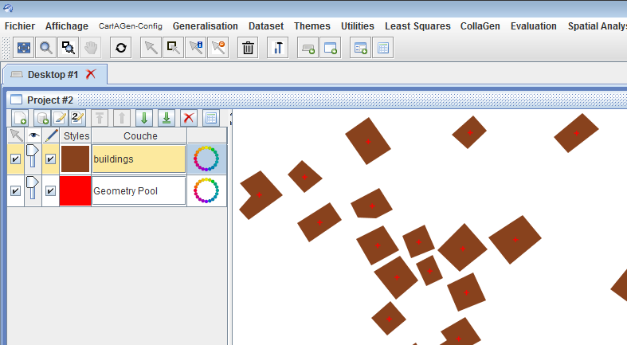
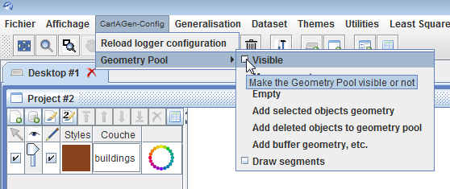

# Tutorial to use the CartAGen user interface
This tutorial explains how to use the CartAGen application user interface, and its main components.

> - Date 20/07/2017.
> - Author: [Guillaume Touya][1]
> - Contact {firstname.lastname}@ign.fr.


Starting CartAGen Application
-------------
CartAgen is not an executable program yet, you need to clone the Java project into an IDE, such as [Eclipse][2] first, before being used. Please refer to the tutorials of your IDE to know how to clone a Github project.
Once the project is cloned, there are Java main programs that can be used to run CartAGen:
- [CartAGenApplicationAgent][3] runs the standard CartAGen application and opens the CartAGen GUI.
- [CartAGenApplicationNoAgent][4] runs a CartAGen application without the interfaces related to agent management.

Both are located in the cartgen-appli project, which contains all the code related to cartagen GUI.

CartAGen plugins: how it works and how to add new ones
-------------
#### [](#header-4)Available plugins

| Plugin name        | Code 							| Short description				|
|:----------------------|:----------------------------------|:------------------------------|
| [Least squares][10]   | [LeastSquaresComponent.java][16]  	| triggers least squares based generalisation processes	|
| [Evaluation][11]	 | [EvaluationComponent.java][17] | contains methods to evaluate the results of generalisation |
| [CollaGen][12]   | [CollaGenComponent.java][18] | an incomplete implementation of the [CollaGen model][22]| 
| [Spatial Analysis][13]   | [SpatialAnalysisComponent.java][19] |   contains spatial analysis tools to characterise data prior to generalisation	|
| [Continuous][14]   | [ContinuousGUIComponent.java][20] | contains tools for continuous generalisation and morphing	| 
| [OpenStreetMap][15]   | [OSMCartAGenPlugin.java][21] | contains specific processes such as the LoD harmonisation for OpenStreetMap data	| 


#### [](#header-4)How to add new plugins

The example code below shows how to create a new plugin for CartAGen, you just have to extend the ```java JMenu ``` class in a new class (here called "NewPlugin") and add items and actions to this new menu.

```java
public class NewPlugin extends JMenu {

  public NewPlugin(String title) {
    super(title);
	...// add menu items and actions to this new menu
    }
	
	...
}
```

Then, if you want to add the new plugin in the CartAGen GUI, you have to modify the CartAGenGUIComponents.xml file that can be found in the cartagen-appli/src/main/resources/xml/ folder. 
The example code below shows how to add the "NewPlugin" plugin into the file. When CartAGen is launched once again, the NewPlugin should appear on the right of the existing menus.

```xml
<Config-CartAGen-GUI-Components>
	<Component>
		<name>Utilities</name>
		<path>fr.ign.cogit.geoxygene.appli.plugin.cartagen.util.UtilitiesGUIComponent</path>
	</Component>
		<Component>
		<name>Least Squares</name>
		<path>fr.ign.cogit.cartagen.appli.plugins.process.leastsquares.LeastSquaresComponent</path>
	</Component>
	<Component>
		<name>CollaGen</name>
		<path>fr.ign.cogit.cartagen.appli.plugins.process.CollaGenComponent</path>
	</Component>
	<Component>
		<name>Evaluation</name>
		<path>fr.ign.cogit.cartagen.appli.plugins.evaluation.EvaluationComponent</path>
	</Component>
	<Component>
		<name>Spatial Analysis</name>
		<path>fr.ign.cogit.cartagen.appli.plugins.spatialanalysis.SpatialAnalysisComponent</path>
	</Component>
	<Component>
		<name>Continuous</name>
		<path>fr.ign.cogit.geoxygene.appli.plugin.cartagen.util.ContinuousGUIComponent</path>
	</Component>
	<Component>
		<name>OpenStreetMap</name>
		<path>fr.ign.cogit.cartagen.appli.plugins.vgi.OSMCartAGenPlugin</path>
	</Component>
	<Component>
		<name>NewPlugin</name>
		<path>fr.ign.cogit.cartagen.appli.plugins.NewPlugin</path>
	</Component>
</Config-CartAGen-GUI-Components>
```

Description of the menus of the application
-------------

#### [](#header-4)File Menu

#### [](#header-4)Display Menu

#### [](#header-4)CartAGen-Config Menu

#### [](#header-4)Generalisation Menu

#### [](#header-4)Dataset Menu

#### [](#header-4)Themes Menu

#### [](#header-4)Utilities Menu

#### [](#header-4)Agent Menu


GeOxygene Plugins
-------------
The CartAGen application is just an extension of the GeOxygene application, with new interface components. 
So, the application can also access to GeOxygene plugins, that work similarly to CartAGen plugins: they usually add a menu with items to access to the geoprocessing algorithms of the GeOxygene platform (data matching, conflation, topological processing, styling, etc.).

The choice of the GeOxygene plugins that are loaded in the CartAGen application is made by filling the geoxygene-configuration.xml file in the cartagen-appli project. The plugins appear in the "Plugins GeOx" menu of the GUI (see image below).


You can find more information on GeOxygene capabilities on [this website][5]. Be aware that a large part of the GeOxygene documentation is in French.

The geometry pool
-------------
The rendering of geographic features works with layers of geographic features, following the OGC standards. But sometimes, it is useful to draw additional geometries, such as final or intermediate geometries of a generalisation algorithm. 
To allow this, CartAGen uses a specific layer, called the Geometry Pool, where any geometry can be rendered with a specific style, on top of the other layers (see image below).



The geometry pool can be made visible, or can be hidden, by using the "visible" check box, in the CartAGen-Config>Geometry Pool menu (see image below).



The CartAGen-Config>Geometry Pool menu also allows the manipulation of the geometry pool (adding the selected features' geometry, clearing the pool, etc.). 
The geometry pool can also be handled in the code. The example code below shows how to retrieve the geometry pool associated with a CartAGen database:

```java
GeometryPool pool = CartAGenDoc.getInstance().getCurrentDataset().getGeometryPool();
```

> TIP: some interface components may be labeled in French, even when using an English locale setting. Please report an issue on Github to have it corrected quickly!

See Also
-------------
- [tutorial on data loading][8]
- [tutorial to generalize loaded data][6]
- [tutorial on CartAGen data schema][9]
- [tutorial to use agent-based generalization][7]

[1]: http://recherche.ign.fr/labos/cogit/english/accueilCOGIT.php
[2]: https://www.eclipse.org/
[3]: https://github.com/IGNF/CartAGen/blob/master/cartagen-appli/src/main/java/fr/ign/cogit/cartagen/appli/core/CartAGenApplicationAgent.java
[4]: https://github.com/IGNF/CartAGen/blob/master/cartagen-appli/src/main/java/fr/ign/cogit/cartagen/appli/core/CartAGenApplicationNoAgent.java
[5]: http://ignf.github.io/geoxygene/
[6]: /tuto_generalization_algo.md
[7]: /tuto_agents.md
[8]: /tuto_import_data.md
[9]: /tuto_schema.md
[10]: /plugins/least_squares_plugin.md
[11]: /plugins/evalaution_plugin.md
[12]: /plugins/collagen_plugin.md
[13]: /plugins/spatial_analysis_plugin.md
[14]: /plugins/continuous_plugin.md
[15]: /plugins/openstreetmap_plugin.md
[16]: https://github.com/IGNF/CartAGen/blob/master/cartagen-appli/src/main/java/fr/ign/cogit/cartagen/appli/plugins/process/leastsquares/LeastSquaresComponent.java
[17]: https://github.com/IGNF/CartAGen/blob/master/cartagen-appli/src/main/java/fr/ign/cogit/cartagen/appli/plugins/evaluation/EvaluationComponent.java
[18]: https://github.com/IGNF/CartAGen/blob/master/cartagen-appli/src/main/java/fr/ign/cogit/cartagen/appli/plugins/process/CollaGenComponent.java
[19]: https://github.com/IGNF/CartAGen/blob/master/cartagen-appli/src/main/java/fr/ign/cogit/cartagen/appli/plugins/spatialanalysis/SpatialAnalysisComponent.java
[20]: https://github.com/IGNF/geoxygene/blob/master/geoxygene-appli/src/main/java/fr/ign/cogit/geoxygene/appli/plugin/cartagen/util/ContinuousGUIComponent.java
[21]: https://github.com/IGNF/CartAGen/blob/master/cartagen-appli/src/main/java/fr/ign/cogit/cartagen/appli/plugins/vgi/OSMCartAGenPlugin.java
[22]: https://www.researchgate.net/publication/226629945_CollaGen_Collaboration_between_automatic_cartographic_Generalisation_Processes