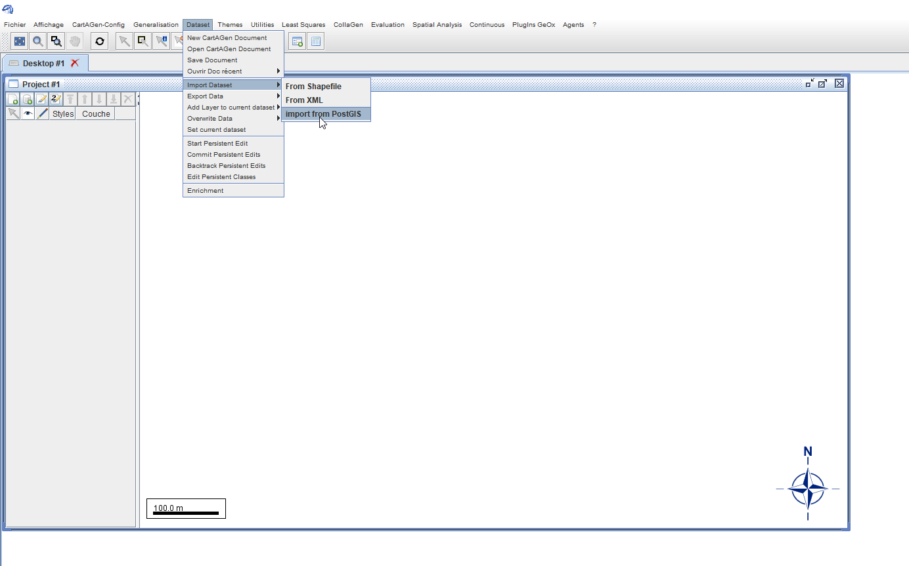
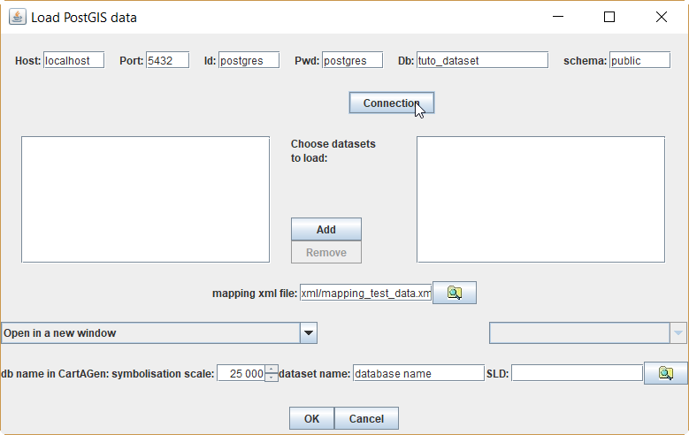
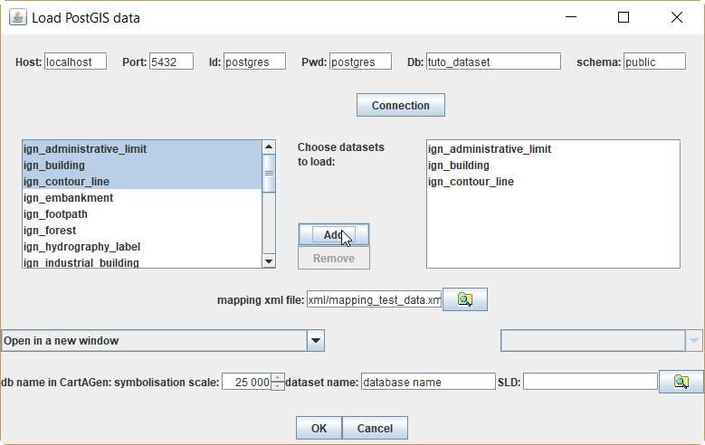
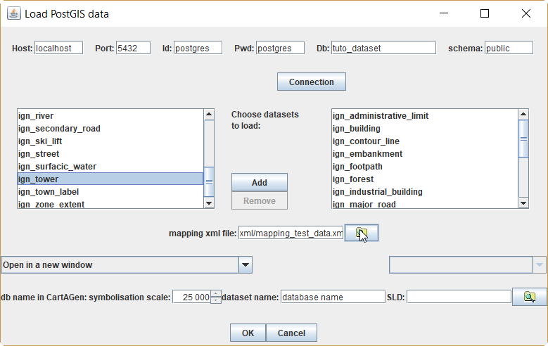
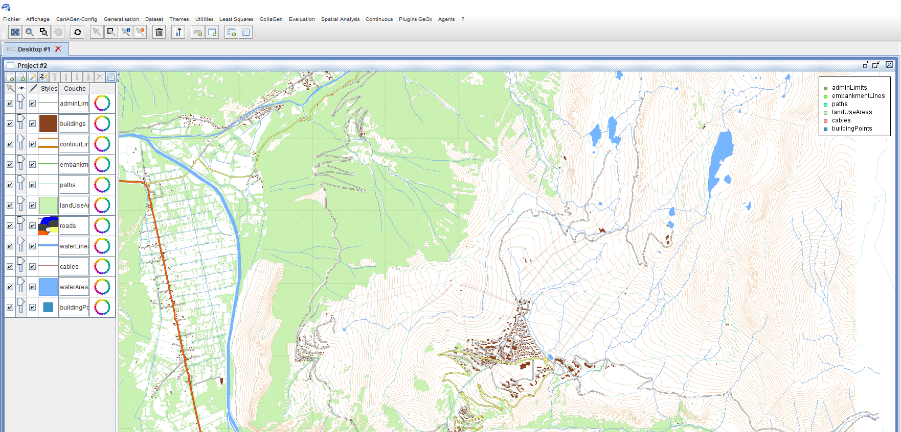

# Tutorial on how to load data in CartAGen


> - Date 20/07/2017.
> - Author: [Guillaume Touya][1]
> - Contact {firstname.lastname}@ign.fr.


Description of the sample dataset
-------------

The test data can be found in the cartagen-appli project [resources][2], alpe_huez_test_data.backup, it is an old extract of IGN (the French National Mapping Agency) data around the skying resort of l'Alpe d'Huez.

This dataset was used in the [EuroSDR generalisation software benchmark][3].


Restoring the sample dataset into PostGIS
-------------
alpe_huez_test_data.backup is a postGreSQL backup, the file has be restored in a postGreSQL database with the postGIS extension. Once restoration is carried, the database contains the following tables:
> -  ign_administrative_limit: contains the administrative city boundaries.
> -  ign_building: contains polygon representing the dwelling buildings or buildings of unknown nature. 
> -  ign_contour_line: contains contour lines representing the terrain with an altitude attribute.
> -  ign_embankment: disconnected lines that represent the ridges of embankments.
> -  ign_footpath: lines that represent footpaths and unpaved paths.
> -  ign_hydrography_label: point labels for hydrography features (sources, lakes, ponds, etc.), river names are not included in this table.
> -  ign_industrial_building: the polygons of industrial or commercial buildings such as factories or supermarkets. 
> -  ign_major_road: contains the most important roads (e.g. highways) represented as centrelines, but with two parallel lines for dual carriageways.
> -  ign_minor_road: contains road lines from the third category (out of 4) of the road classification.
> -  ign_orography_label: point labels for orography features (peaks, valleys, passes, etc.).
> -  ign_public_building: the polygons of public buildings such as town halls or schools.
> -  ign_river: contains river centrelines with the name as attribute.
> -  ign_secondary_road: contains road lines from the second category (out of 4) of the road classification.
> -  ign_ski_lift: ski lift lines.
> -  ign_street: last category of the road classification of the dataset, the least important roads, e.g. minor streets.
> -  ign_surfacic_water: polygons of water including large rivers and lakes.
> -  ign_tower: point features that represent towers or other high features (antenna, etc.).
> -  ign_town_label: point labels for towns.
> -  ign_zone_extent: a polygon that marks the boundary of the test dataset. This polygon can be useful to create the road blocks using the faces of the road network graph.

Filling the mapping XML file
-------------
The CartAGen librairies use a [centralized data schema][8] in order to avoid dependencies to specific data schemas in algorithms. 
So the first step load some new dataset in CartAGen is to map the data schema to this centralized schema: that's what the XML mapping file is for.
You can see in the [tutorial on the centralized schema][8] that the schema can have several implementations, and the first part of the mapping file describes the implementation you want to use. Here, the default implementation is chosen (and should be in most cases).

```xml
<mapping>
    <gene-obj-implementation>
    	<name>default</name>
    	<factory>fr.ign.cogit.cartagen.core.defaultschema.DefaultCreationFactory</factory>
    	<root-package-name>fr.ign.cogit.cartagen.core.defaultschema</root-package-name>
    	<root-class>fr.ign.cogit.cartagen.core.defaultschema.GeneObjDefault</root-class>
</gene-obj-implementation>
```

Then, the mapping file is composed of a list of ```<matching>``` elements that describe how a table of the postGIS database can be loaded as one of the Java classes of the centralized schema.

```xml
    <matching>
        <postgisLayer>ign_minor_road</postgisLayer>
        <creationMethod>createRoadLine</creationMethod>
        <scaleRef>15000</scaleRef>
        <theme>road</theme>
        <attributes>
            <attribute>
                <postgisAttr>importance</postgisAttr>
                <javaAttr>importance</javaAttr>
            </attribute>
        </attributes>
</matching>
```

The above matching example matches the table "ign_minor_road" to the creation method of the ```IRoadLine```, that can be found [here][4]. So, the loader will create IRoadLine instances with the lines in the ign_minor_road table.
The ```<scaleRef>``` element gives the reference scale of the loaded data.
The ```<theme>``` element refers to an ontology concept that matches this type of feature, here, "road". Such ontological concepts were used for instance in the [ScaleMaster 2.0][5]. For now, this ontology reference is not used in CartAGen, but has been added for further interoperability issues.
The ```<attribute>``` elements describe mappings between postGIS attributes and the Java fields of the centralized schema. In this example, both datasets have an "importance" attribute that gives the importance of the road in the classification of roads.

The file "mapping_test_data.xml" available in the [resources of cartagen-appli module][6] already contains a complete mapping of the tutorial data, but can be used as a template for future imports with different dataset.

Loading the dataset in the application
-------------
To import the dataset into CartAGen, you have to launch CartAGen by running the class [CartAGenApplicationAgent][11] or [CartAGenApplicationNoAgent][12] depending if you want to use agent-based generalization or not.
Go into the "Dataset" menu, then the "Import dataset" submenu, and then click on "Import from PostGIS".



Clicking on the menu button opens a window where information on the data to import must be given. The first step is to connect to PostGIS by filling the text fields at the top of the window (see figure below). The database name is the one you used when restoring the tutorial database into PostGIS.
The id, password, port and host information has to be changed of course, to match to your PostGIS installation.
When all the above fields are filled, you can click on the "Connection" button to actually connect CartAGen to PostGIS.



Once the connection is established with PostGIS, a list of tables existing in the selected database is displayed in the left list panel. You have to select the ones you want to import and click on the "Add" button in the middle (see figure below).
Tables that have been added can be removed by selecting them in the right panel and by clicking on the "Remove" button that is enabled once a table is selected in the right panel.
Multiple selection are possible in both panels.



Once the tables we want to import have been selected, the mapping file can be selected using the "browse" button. By default, the default mapping file used in this tutorial is selected, so there no need to browse for another one.



Data rendering, as most of the GUI, is based on open source platform [GeOxygene][13], also developed by IGN France. To specify the style of the displayed layers, GeOxygene, and CartAGen, use the SLD/SE standard. See documentations on the [GeOxygene website][13] to learn more on SLD.
By default, i.e. if the field to specify a SLD file is left empty, the loaded data is rendered using a default SLD, that can be found [here][14], that uses a classical topographic mapping style (see figure below).



The dataset can also be imported by code, using the same code as the loading window, that can be found [here][10].

Importing shapefiles
-------------
The tutorial above only allows the import of geographical datasets stored in a PostGIS database. But shapefiles can also be imported in CartAGen, in a slightly different way.


Importing .osm files
-------------

It is also possible to load extract from OpenStreetMap with .osm formatted files.
The matching between OSM tags and CartAGen feature types is automatic (encoded in the OSM loader).
To load OSM files, you have to use the 'OpenStreetMap' menu (see image below)


Clicking on the menu item opens a window (see image below) where the .osm file to load can be specified, as well as the map projection to use. 
As CartAGen uses parameters in map millimeters, it does not work properly if the data is loaded with geographic coordinates: the dataset has to be projected into a given map projection.
Only a very small extract of the existing map projections is available in this window, so additional map projections will have to be added in the code of the window to be able to use them. 
CartAGen uses Geotools library for projections, which gives a large variety of map projection that can be used.
It is also possible to filter the loaded features by specifying a tag filter: the loader will only consider the features that have the specific tag (with no regard to the value of the tag). 
To only load roads, you have to put "highway" in the text field.


In order to test this importing method, a .osm file was extracted from OpenStreetMap on Sept. 26th 2017, on the Alpe d'Huez area.

The 'Import recent files' menu gives a shortcut access to the last five files that were loaded in CartAGen.

Saving and loading CartAGen Documents
-------------


See Also
-------------
- [tutorial on CartAGen centralized schema][8]
- [tutorial to generalize loaded data][9]
- [tutorial to generalize loaded data with agent-based processes][7]


[1]: http://recherche.ign.fr/labos/cogit/english/cv.php?prenom=&nom=Touya
[2]: https://github.com/IGNF/CartAGen/tree/master/cartagen-appli/src/main/resources/data
[3]: http://www.sciencedirect.com/science/article/pii/S0198971509000465
[4]: https://github.com/IGNF/CartAGen/blob/master/cartagen-core/src/main/java/fr/ign/cogit/cartagen/core/genericschema/AbstractCreationFactory.java
[5]: http://www.tandfonline.com/doi/abs/10.1080/15230406.2013.809233
[6]: https://github.com/IGNF/CartAGen/blob/master/cartagen-appli/src/main/resources/xml/mapping_test_data.xml
[7]: /tuto_agents.md
[8]: /tuto_schema.md
[9]: /tuto_generalization_algo.md
[10]: https://github.com/IGNF/CartAGen/blob/master/cartagen-core/src/main/java/fr/ign/cogit/cartagen/core/dataset/postgis/PostGISLoader.java
[11]: https://github.com/IGNF/CartAGen/blob/master/cartagen-appli/src/main/java/fr/ign/cogit/cartagen/appli/core/CartAGenApplicationAgent.java
[12]: https://github.com/IGNF/CartAGen/blob/master/cartagen-appli/src/main/java/fr/ign/cogit/cartagen/appli/core/CartAGenApplicationNoAgent.java
[13]: http://ignf.github.io/geoxygene/
[14]: https://github.com/IGNF/CartAGen/blob/master/cartagen-appli/src/main/resources/sld/CartagenStyles.xml